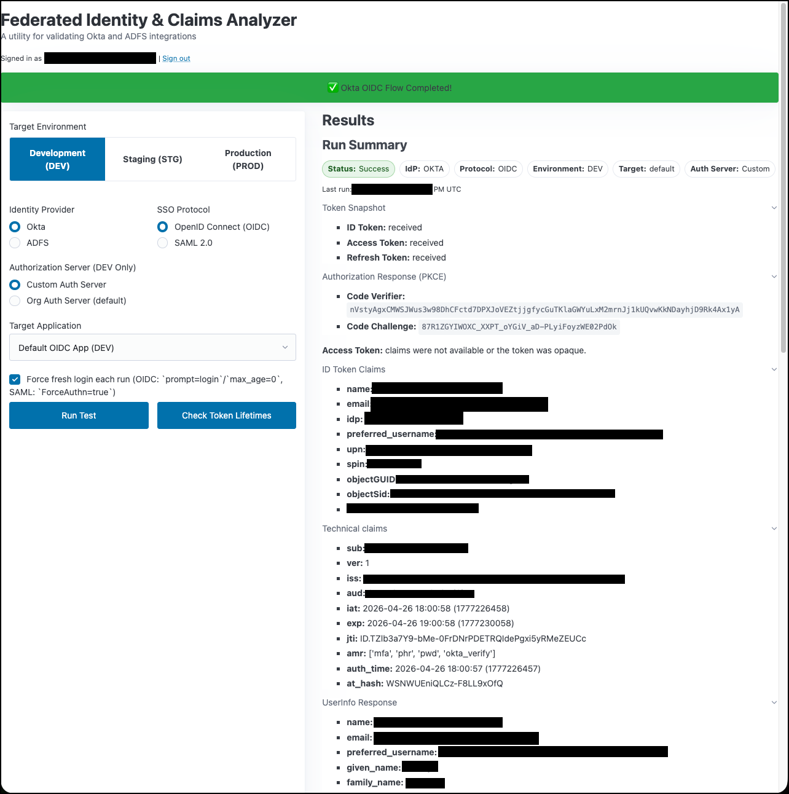

> **Full-stack identity testing platform — when an SSO flow is
> misbehaving, this is what I reach for to get ground truth on JWTs,
> SAML assertions, and federation metadata across providers.**

# Federated Identity & Claims Analyzer

A comprehensive web application for testing and analyzing federated identity protocols (OIDC and SAML) across multiple identity providers.



---

### About this repo

This is a sanitized snapshot of internal tooling, published via an
automated review-and-publish pipeline. Internal identifiers
(subscription IDs, resource group names, internal hostnames, email
addresses) are deliberately replaced with placeholders like
`your-subscription-id`, `your-acr-name`, and `your-org`. Replace
these with values appropriate to your environment when adapting
the code.

---

## Overview

This tool allows you to:
- Test OIDC and SAML authentication flows with Okta, ADFS, and Azure AD
- Inspect ID tokens, access tokens, and refresh tokens
- View decoded JWT claims and SAML assertions
- Check token lifetimes and refresh token behavior
- Analyze authentication traces and troubleshoot SSO issues

## Current Deployment

**Platform**: Azure Container Apps
**URL**: https://federated-claims-analyzer.your-env.eastus.azurecontainerapps.io
**Authentication**: Azure AD (Entra ID) - All users in the tenant are authorized

## Architecture

- **Runtime**: Python 3.11
- **Web Framework**: Flask with Gunicorn (2 workers, 4 threads per worker)
- **Authentication**: Azure AD OIDC for application access
- **Session Storage**: Flask signed cookie sessions (multi-instance safe)
- **Secrets Management**: Azure Container Apps secrets (injected as environment variables)
- **Deployment**: Docker container on Azure Container Apps with automatic HTTPS

## Features

### Supported Identity Providers

1. **Okta** (DEV and PROD environments)
   - OIDC with custom and default authorization servers
   - SAML 2.0
   - Token Lifetime Check (TLC) - query access/refresh token lifetimes without SSO

2. **ADFS** (DEV and PROD environments)
   - OIDC
   - SAML 2.0

3. **Azure AD** (Entra ID)
   - OIDC (used for application login gate)

### Authentication Protocols

- **OIDC**: Full OAuth 2.0 authorization code flow with PKCE
- **SAML 2.0**: SP-initiated flows with signature validation

### Token Analysis

- ID Token validation with JWKS
- Access Token validation (when JWT format)
- Refresh Token support with token refresh functionality
- UserInfo endpoint queries
- SAML assertion parsing and attribute extraction

## Deployment

### Azure Container Apps

Current deployment uses Azure Container Apps for:
- Automatic HTTPS with managed certificates
- Automatic scaling (0-2 replicas based on load)
- No infrastructure management
- Cost optimization (~$10-30/month vs ~$150/month for AKS)

#### Build and Deploy

```bash
# Build image in Azure Container Registry
az acr build --registry my-acr \
  --image federated-claims-analyzer:latest \
  --file Dockerfile .

# Update Container App
az containerapp update \
  --name federated-claims-analyzer \
  --resource-group my-resource-group \
  --image my-acr.azurecr.io/federated-claims-analyzer:latest
```

#### Configure Secrets

All secrets are managed via Azure Container Apps secrets:

```bash
az containerapp secret set \
  --name federated-claims-analyzer \
  --resource-group my-resource-group \
  --secrets \
    flask-secret-key='<secret>' \
    azure-oidc-client-id='<client-id>' \
    azure-oidc-client-secret='<client-secret>' \
    azure-oidc-tenant-id='<tenant-id>' \
    okta-dev-oidc-secret='<secret>' \
    okta-prod-oidc-secret='<secret>' \
    okta-dev-api-token='<token>' \
    okta-prod-api-token='<token>' \
    adfs-dev-client-secret='<secret>' \
    adfs-prod-client-secret='<secret>' \
    saml-tester-cert='<cert-pem>' \
    saml-tester-key='<key-pem>'
```

### Local Development

```bash
# Install dependencies
pip install -r requirements.txt

# Set environment variables (copy from env.config.DO_NOT_SHARE)
export FLASK_SECRET_KEY='...'
export AZURE_OIDC_CLIENT_ID='...'
# ... etc

# Run locally
python app.py

# Or with gunicorn
gunicorn --bind 0.0.0.0:8080 --workers 2 --threads 4 app:app
```

### Pre-Deployment Smoke Tests

Run smoke tests before deploying:

```bash
python smoke_test.py
```

Tests include:
- Python syntax and imports
- Dependency verification
- Flask app instantiation
- Azure environment detection
- Required environment variables
- Documentation file validation

## Configuration

### Identity Provider Endpoints

All IdP endpoints are configured in `sso_tester_logic.py`:

- **Okta DEV**: `https://host.example.gov` or `https://dev-your-org.okta.com`
- **Okta PROD**: `https://host.example.gov`
- **ADFS DEV**: `https://host.example.gov/[redacted-path]
- **ADFS PROD**: `https://host.example.gov/[redacted-path]

### Redirect URIs

Configure these redirect URIs in your IdP applications:

- **Azure AD OIDC**: `https://federated-claims-analyzer.your-env.eastus.azurecontainerapps.io/azure/oidc/callback`
- **Okta OIDC**: `https://federated-claims-analyzer.your-env.eastus.azurecontainerapps.io/okta/oidc/callback`
- **Okta SAML**: `https://federated-claims-analyzer.your-env.eastus.azurecontainerapps.io/okta/saml/callback`
- **ADFS OIDC**: `https://federated-claims-analyzer.your-env.eastus.azurecontainerapps.io/adfs/oidc/callback`
- **ADFS SAML**: `https://federated-claims-analyzer.your-env.eastus.azurecontainerapps.io/adfs/saml/callback`

## Version History

- **v7.0** (2026-02-05): Migrated from AKS to Azure Container Apps
- **v6.0** (2026-02-04): Migrated from Google Cloud Run to AKS with Azure AD authentication
- **v5.1** (2026-01-30): Security hardening with HTTP headers and SAML cert fix
- **v5.0** (2026-01-30): Operational robustness (smoke tests, timeouts, logging, JWKS caching)
- **v4.3** (2026-01-30): Flask cookie sessions and Secret Manager for SAML certs
- **v4.2** (2026-01-30): Google Cloud Secret Manager migration
- **v4.1** (2026-01-30): TLC integration and favicon
- **v4.0** (2026-01-20): Google OIDC gate with Firestore allowlist

## Documentation

- [AGENTS.md](AGENTS.md) - Project rules for file management and versioning
- [AZURE_AD_SETUP.md](AZURE_AD_SETUP.md) - Azure AD App Registration setup guide
- [SESSION_NOTES.md](SESSION_NOTES.md) - Detailed session history and change log
- [Dockerfile](Dockerfile) - Production container configuration

## Security Features

- Non-root container user
- Signed cookie sessions (no filesystem dependencies)
- Azure Container Apps managed secrets
- Comprehensive security headers (HSTS, CSP, X-Frame-Options, etc.)
- HTTPS-only in production
- PKCE for OIDC flows
- SAML signature validation

## Troubleshooting

### Multi-Worker Issues

The application runs with 2 gunicorn workers. OIDC endpoint discovery is re-run on each callback to ensure multi-worker safety (endpoints discovered in Worker 1 are available in Worker 2).

### Large Session Cookies

Session cookies may exceed browser limits (~4KB) with large SAML responses. This is expected and browsers handle it gracefully.

### SAML Certificate Errors

SAML certificates are loaded from Azure Container Apps secrets and written to `/tmp/` at startup. Ensure `SAML_TESTER_CERT` and `SAML_TESTER_KEY` secrets are properly configured.

## License

MIT License

## Author

Wes Glockzin

<!-- CODEX_WORK_UPDATE_START -->
## Codex Work Participation Update (2026-03-20)
- Performed a repository-wide Markdown refresh to keep documentation aligned.
- Added/updated this note during the current maintenance task.
<!-- CODEX_WORK_UPDATE_END -->
