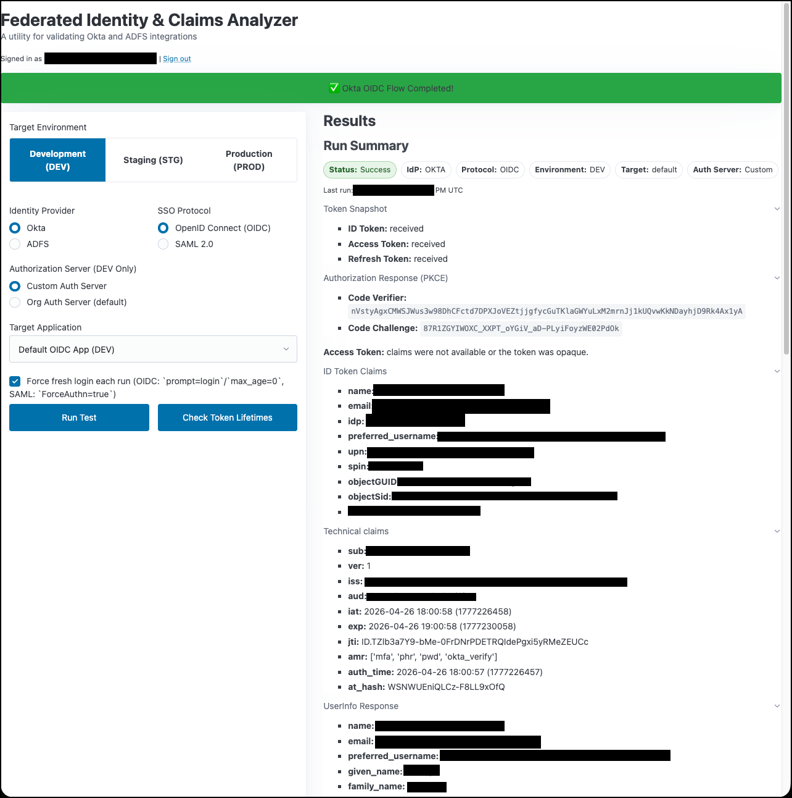

> **When an SSO flow is misbehaving, this is what I reach for to get ground
> truth — every claim, every attribute, every token, the signed and decoded
> JWTs, the full SAML assertion — from a real sign-in against the real IdP.**

# Federated Identity & Claims Analyzer

An interactive SSO tester for Okta and ADFS. Pick an identity provider and a
protocol (OIDC or SAML 2.0), the tool runs the full sign-in against your
account, and shows you exactly what came back.



---

### About this repo

This is a sanitized snapshot of an internal tool, published through an
automated review-and-publish pipeline. Internal identifiers — hostnames,
tenant names, resource names, certificates, Okta object IDs — are replaced
with placeholders (`host.example.gov`, `your-resource-group`, a throwaway
self-signed certificate, `0oaEXAMPLE00EXAMPLE0`). The code is the code that
runs; the configuration values are not. Replace them with your own.

---

## What it does

- Runs a **real, end-to-end sign-in** against Okta (DEV / STG / PROD orgs) or
  ADFS (DEV / PROD) using **OIDC** (authorization code + PKCE) or **SAML 2.0**
  (SP-initiated).
- Decodes and displays every claim and attribute, separated into *implicit*
  (protocol) and *detailed* (custom) sets, plus the raw tokens and the raw
  SAML assertion.
- **Token Lifetime Check** — queries an Okta authorization server's policy
  rules for access/refresh token lifetimes without running a sign-in.
- **Refresh** — exercises the refresh-token grant against the IdP and shows
  the new tokens.
- **Force fresh login** — runs the flow with `prompt=login` so a cached IdP
  session can't mask what a cold sign-in returns.

## What it doesn't do

- It doesn't create or modify users, and it doesn't change IdP configuration.
- It isn't a load tester — single interactive flow.
- It isn't a substitute for the IdP's own logs when you need to know what a
  *user* experienced; it tells you what *you* see when you reproduce.

## How validation works

| Path | What is verified |
|---|---|
| Okta / ADFS **ID token** | Signature against the IdP's JWKS (`RS256` only), `aud`, `iss`, `exp` — via `python-jose` |
| Okta **access token** | Same, when the token is a JWT (custom authorization servers) |
| **SAML response** | Signature, `strict` mode, `wantAssertionsSigned`, SHA-256 — via `python3-saml` |
| ADFS **access token** | **Decoded without verification.** ADFS access tokens are opaque to the SP by design; the claims are shown for inspection only and are *not* trustworthy. This is labeled in the code (`verify_signature=False`). |

## Project layout

| File | Role |
|---|---|
| `app.py` | Flask app — auth gate, test runner, callbacks, refresh, lifetime check |
| `sso_tester_logic.py` | OIDC discovery, PKCE, JWKS validation, SAML processing, TLC |
| `saml_settings.py` | Per-IdP SAML settings for `python3-saml` (entity IDs, SSO URLs, certificates) |
| `index.html`, `login.html` | Templates (served from the app directory) |
| `HOWTO.md` | In-app help, rendered at `/howto` |
| `smoke_test.py` | Pre-deploy static checks and post-deploy reachability checks |
| `Dockerfile` | Container image (gunicorn, 2 workers × 4 threads) |

## Routes

| Route | Purpose |
|---|---|
| `/` | Test form and results |
| `/run_test` `POST` | Start a flow for the chosen IdP + protocol |
| `/okta/oidc/callback`, `/adfs/oidc/callback` | OIDC redirect URIs |
| `/okta/saml/callback`, `/adfs/saml/callback` `POST` | SAML assertion consumer URLs |
| `/check_token_lifetimes` `POST` | Token Lifetime Check |
| `/refresh_token` `POST` | Refresh-token grant |
| `/login`, `/oidc/login`, `/oidc/callback`, `/logout` | The tool's own sign-in gate (Okta OIDC) |
| `/howto` | In-app help |
| `/health` | Liveness |

## Access to the tool itself

The app is gated by its own **Okta OIDC** client (authorization code + PKCE,
`state` and `nonce` validated by Authlib). Who may use it is decided by
assignment on that Okta application — there is no in-app allowlist.

Set `OIDC_ISSUER`, `OIDC_CLIENT_ID`, `OIDC_CLIENT_SECRET` and `APP_BASE_URL`.
**If they are not set, the gate is disabled and the app serves open** — that
is intended for local development only; see *Known limitations*.

## Configuration

Everything is environment variables (locally via `env.config`, which is never
committed; in Azure Container Apps via secrets injected as env vars).

| Variable | Required | Purpose |
|---|---|---|
| `FLASK_SECRET_KEY` | yes | Session signing — must be identical across workers |
| `OKTA_DEV_OIDC_SECRET` | yes | Okta DEV client secret for the tester's OIDC app |
| `OKTA_STG_OIDC_SECRET`, `OKTA_PROD_OIDC_SECRET` | no | Same for STG / PROD (their tests fail without them) |
| `ADFS_DEV_CLIENT_SECRET`, `ADFS_PROD_CLIENT_SECRET` | yes | ADFS OIDC client secrets |
| `OKTA_DEV_API_TOKEN`, `OKTA_PROD_API_TOKEN` | for TLC | Read-only API tokens for the Token Lifetime Check |
| `OIDC_ISSUER`, `OIDC_CLIENT_ID`, `OIDC_CLIENT_SECRET` | for the gate | The tool's own sign-in |
| `APP_BASE_URL` | yes | Public base URL; used to build redirect URIs and cookie flags |
| `APP_AUTH_GATE_ENABLED` | no | Default `true` |
| `FORCE_FRESH_LOGIN_DEFAULT` | no | Default `true` |

IdP endpoints (issuer URLs, SAML SSO URLs, entity IDs, signing certificates)
live in `sso_tester_logic.py` and `saml_settings.py`. In this snapshot they
are placeholders. The SP signing keypair (`saml_tester.cert` / `saml_tester.key`)
sits next to the app and is not committed.

## Running it

```bash
pip install -r requirements.txt
cp env.config.template env.config   # fill in values
python app.py                       # HTTPS on :8080 using the SP keypair as the dev cert
```

Deployment is Azure Container Apps. Images are built and promoted by the
fleet's shared scripts — build → DEV, then a digest-gated DEV → PROD
promotion — rather than by a per-tool deploy script. `smoke_test.py` runs
static checks before a build and reachability checks after.

## Known limitations

Honest list — these are real and on the roadmap, roughly in this order.

- **Gate fails open when unconfigured.** Missing `OIDC_*` disables the sign-in
  gate with a log warning instead of refusing to start. Fine on a laptop,
  wrong on an internet-facing deployment; a fail-closed startup check is the
  next change.
- **Tokens live in the session cookie.** Raw ID/access/refresh tokens and the
  pretty-printed SAML response are stored in Flask's signed (not encrypted)
  cookie so results survive the redirect. Large SAML responses can push the
  cookie past the ~4 KB browser limit, which drops the session. Moving to a
  server-side store is the fix.
- **Validation failures render as "no token."** When a signature or `aud` /
  `iss` check fails, the claims panel shows "ID Token was not provided by the
  IdP" rather than the specific validation error. The error is logged, not
  surfaced.
- **OIDC discovery is module-global.** Under 2 workers × 4 threads, two
  operators testing different Okta orgs at the same moment can race on the
  discovered endpoints.
- `/login?next=` is not restricted to same-origin paths.
- No automated tests beyond `smoke_test.py`; no CI yet.

## Version

`APP_VERSION` in `sso_tester_logic.py` is authoritative (currently 7.3.x).

## License

MIT — see [LICENSE](LICENSE).

## Author

Wes Glockzin
